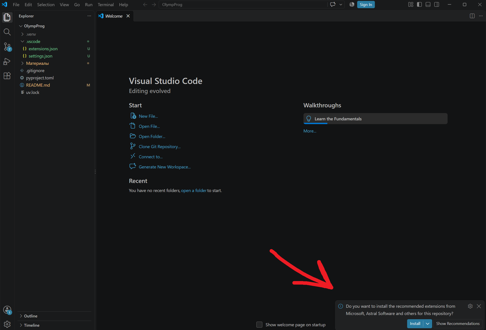
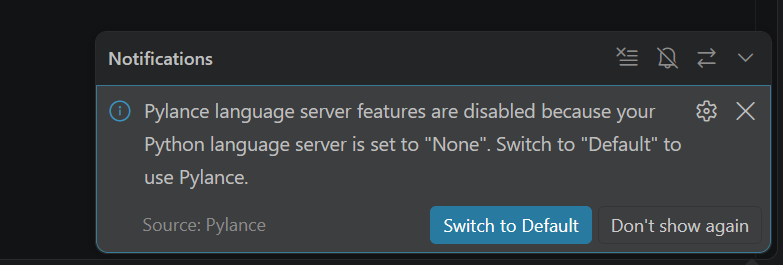
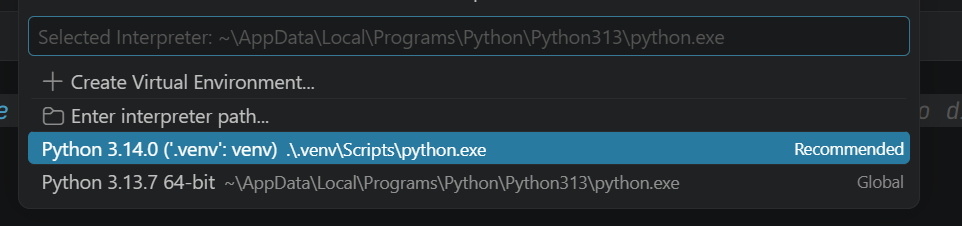

# Настройка рабочего окружения (Windows)

Для спецкурса понадобится редактор кода и Python. В общем, можно всё делать в самом простом блокноте, и запускать (да и писать) код в каком-нибудь из онлайн-интерпретаторов ([onlinegdb](https://www.onlinegdb.com/online_python_interpreter), [w3s](https://www.w3schools.com/python/python_compiler.asp), другие...). Можно также и другими языками программирования пользоваться, которые разрешены на олимпиадах.

**Этот гайд** про установку редактора [*Visual Studio Code*](https://code.visualstudio.com/docs/setup/windows), системы контроля версий [*Git*](https://git-scm.com/install/windows) и менеджера для Python: [*uv*](https://docs.astral.sh/uv/#installation). Всё это для ОС Windows (10/11). Если у вас дистрибутив Linux, надеюсь, вы с этим справитесь сами :)

На всё про всё уйдёт около 10-15 минут


#### NB!: можно пользоваться не только лишь этими инструментами!
- *VSCode* я выбрал в качестве редактора, потому что он достаточно кастомизируемый и относительно лёгкий и быстрый. Можно выбрать любой другой, хоть блокнот. Можно и PyCharm поставить, но это большая среда разработки, для олимпиад это overkill
- *Git* - наиболее широко распространённая система контроля версий - если кто-то хочет добавлять свои материалы или решения задач, и в целом интересуется программированием, рекомендую ознакомиться, вещь крайне полезная
- *uv* - менеджер версий Python и пакетов для Python. Можно поставить Python напрямую с официального сайта, но *uv* позволяет легко управлять сразу несколькими версиями интерпретатора без особых проблем. Также это отличная замена *pip* (встроенный пакетный менеджер Python), *venv* (утилита для создания виртуальных окружений - по сути изолированных интерпретаторов Python)

## **Шаг 1.** VSCode и Git

### Visual Studio Code
Можно следовать гайду [на официальном сайте](https://code.visualstudio.com/docs/setup/windows).

1. Скачайте редактор [с официального сайта](https://code.visualstudio.com/Download). У него есть разные версии, у каждой два варианта: x64 и arm64. Скорее всего, у вас x64. Версии следующие:
    - *User Installer* - установка для одного пользователя
    - *System Installer* - установка для **всех** пользователей на компьютере
    - ***.zip*** - "переносная" версия - помещается в одну директорию. Очень советую, так проще в будущем будет от VSCode избавиться :). У него есть отдельная страничка [в документации](https://code.visualstudio.com/docs/setup/portable)
    - *CLI* - нас не интересует...
2. Запустите установщик. В установщике выберите нужное местоположение. Также в какой-то момент он попросит поставить галочки:
    - [x] `Add "Open with Code" action to Windows Explorer file context menu`
    - [x] `Add "Open with Code" action to Windows Explorer directory context menu`
    - [x] `Add to PATH` - эту лучше выбрать

    Первые две галочки добавляют кнопку "Open with Code" в меню ПКМ, когда вы нажимаете ПКМ на файлах или директориях. Третья добавляет `vscode.exe` в PATH: так можно запускать VSCode из командной строки, просто написав `code`.
3. Должно быть готово!

### Git
Можно следовать гайду [на официальном сайте](https://git-scm.com/install/windows). 

1. В командной строке (`Win + R`, ввести `cmd`) или в PowerShell/Терминале (`Win + X`, выбрать "Терминал", ***НЕ*** в режиме администратора) попробуйте запустить команду:
    ```powershell
    winget install --id Git.Git -e --source winget
    ```
    Если установка началась, то супер, можно к шагу 3, пропустив шаг 2
2. Скачайте Git с [официального сайта](https://git-scm.com/install/windows)
3. В мастере установки все настройки можно оставить по умолчанию. В разделе "Choose the default editor used by Git" можно выбрать VSCode.
4. *Закройте и откройте заново* командную строку/PowerShell и проверьте, что Git установился, команой `git --version`, должна появиться версия.

## **Шаг 2.** uv
Можно следовать гайду на [официальном сайте](https://docs.astral.sh/uv/#installation).

1. В командной строке (`Win + R`, ввести `cmd`) или в PowerShell/Терминале (`Win + X`, выбрать "Терминал", ***НЕ*** в режиме администратора) запустите:
```powershell
powershell -ExecutionPolicy ByPass -c "irm https://astral.sh/uv/install.ps1 | iex"
```
4. *Закройте и откройте заново* командную строку/PowerShell и проверьте, что Git установился, команой `uv --version`, должна появиться версия.

## **Шаг 3.** настройка проекта
В этом репозитории хранятся материалы курса и настройки для VSCode и проекта uv.

**NB!** все следующие команды нужно будет выполнять в командной строке (`Win + R`, `cmd`) или терминале (`Win + X`, "Терминал", ***НЕ*** в режиме администратора).

1. Склонируйте репозиторий в нужную папку:
```powershell
# Перейдите в папку, куда хочешь склонировать репозиторий
# Например, у меня это будет C:\Пользователи\MyUsername\Projects\
# NB! Перед этим нужно будет создать ту самую папку Projects
cd C:\Users\MyUsername\Projects

# а для D:\Мои проекты\Олимпиадное программирование\ команда такая, например:
# cd D:\'Мои Проекты'\'Олимпиадное программирование'
# обратите внимание на одиночные кавычки!

# клонирование репозитория
git clone https://github.com/OXygen1771/olymp-prog-course.git

# Перейдите в папку репозитория
cd olymp-prog-course
```

2. Настройте виртуальное окружение Python:
```powershell
# Эта команда прочитает pyproject.toml, установит нужную версию Python в
# скрытую папку .venv, туда же он скачает ruff и ty - инструменты для
# разработки, которые будут подсказывать, где в коде ошибки
uv sync

# всё :)
```

3. Откройте VScode:
```powershell
# точка в конце обязательна! Она означает "открыть текущую директорию"
code .
```

## **Шаг 4.** настройка VSCode
1. VSCode сам предложит установить рекомендуемые расширения. Нажмите "Установить", VSCode поставит плагины для работы с Python, ruff и ty.

2. Когда вы откроете какой-нибудь файл `.py`, VSCode предложит вам включить Pylance. Нам это не нужно, можно "больше не показывать":

3. Нужно выбрать интерпретатор Python. Для этого нажмите `Ctrl + Shift + P` и начните вводить `interpreter`: там будет опция "Python: Select Interpreter". Нажимаем `Enter`, в спсике выбираем тот, у которого в скобках указано `.venv` (скорее всего, там ещё будет написано "Recommended"):


Попробуйте написать какой-нибудь плохо отформатированный код, например:
```python
x=1; y  = 2;    z=x    +        y
```
И после сохранения (`Ctrl + S`) это должно отформатироваться в:
```python
x = 1
y = 2
z = x + y
```
